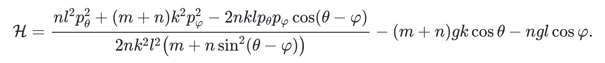
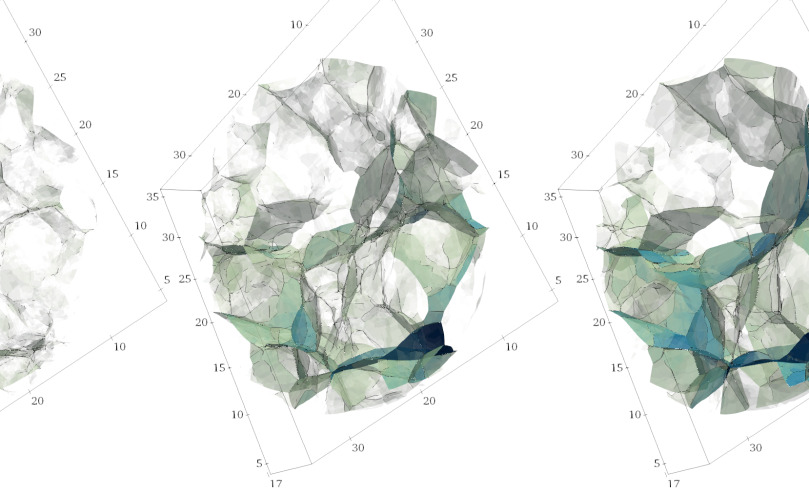

!!! note "CarboKitten.jl"
    [CarboKitten](https://mindthegap-erc.github.io/CarboKitten.jl/) is an open-source toolkit for modelling carbonate platforms stratigraphy, written in Julia.

    

!!! note "Slasher game in Elm"
    

    [Slasher](https://entangled.github.io/examples/slasher.html) is action packed browser game, written in Elm! Our hero zips across the screen at break-neck speeds and you have to steer them to the golden snitch using only `/` and `\` characters.

!!! note "Rattler book"
    [Rattler Book](https://prefix-dev.github.io/rattler-book/), A book on building Moonshot, a Lua Package Manager. This book uses MkDocs to render the website, with many inhouse developed addons, including a nice system of cross-referencing code blocks.

    

!!! note "Chaotic Pendulum"
    
    
    [This demo](https://jhidding.github.io/chaotic-pendulum/) uses PureScript to code a chaotic pendulum widget. The website is rendered with Pandoc, using a Bootstrap template. If you're in for learning some advanced mechanics and PureScript at the same time, or you just want to see the demo, take a look!

!!! note "Adhesion Model"
    [The adhesion model](https://jhidding.github.io/adhesion-code/) simulates the formation of structure in the Universe on the largest scales. This code computes this model using the C++ CGAL library.

    

