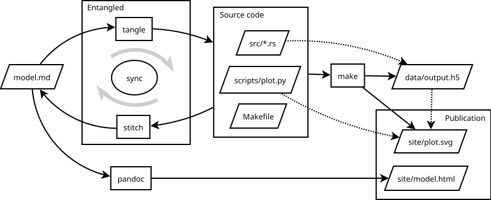

---
tags:
    - research
    - motivation
---

# Research Paper
**Johan Hidding ([Netherlands eScience Center](https://esciencecenter.nl/))**

> Published version: J. Hidding, **Entangled, a Bidirectional System for Sustainable Literate Programming**, 2023 IEEE 19th International Conference on e-Science (e-Science), Limassol, Cyprus, 2023, pp. 1-9
> [doi:10.1109/e-Science58273.2023.10254816](https://doi.org/10.1109/e-Science58273.2023.10254816)
>
> ??? BibTeX
>
>     ```bibtex
>     @inproceedings{Hidding2023,
>     author={Hidding, Johan},
>     booktitle={2023 IEEE 19th International Conference on e-Science (e-Science)}, 
>     title={Entangled, a Bidirectional System for Sustainable Literate Programming}, 
>     year={2023},
>     volume={},
>     number={},
>     pages={1-9},
>     keywords={Open Access;Source coding;Debugging;Programming;Software;Software reliability;Synchronization;literate programming;open science;tooling},
>     doi={10.1109/e-Science58273.2023.10254816}}
>     ```

&copy; 2023 IEEE

### Abstract

In order to increase the reliability of scientific discourse, the Open Science movement has proposed stronger emphasis open access publishing, open data, and improved coding practices. Such goals should also be supported by better tooling for publishing research with a strong software component.

  Literate Programming is a paradigm for creating and publishing about software, where functioning source code is interlaced with literary prose. As such literate programming is ideal for mixing scientific content with its own software implementation. The reason why literate programming has not found widespread adoption by the community is two-fold: lack of proper tooling and general unawareness in the scientific community.

  Entangled aims to remedy the first problem, with the long term ambition to work on the second. A problem holding back literate programming has always been the perceived lack of maintainability of literate programs. Entangled is a Markdown based system that keeps the literate text synchronized with extracted source code. Because Entangled works both ways, the user can keep using their IDE for linting, debugging or AI outsourcing.
  
  This paper explores the Entangled method, how it fits with current landscape of tooling, and ramifications for how software publications could look in the future.

## Motivation

Society is facing many challenges. Many of these challenges, environmental pollution, climate change, increased risk of pandemics, to name a few, have a strong involvement of scientific discourse. It is all the more important that our science is trustworthy.

Many authors have in the past raised concerns over what has become known to be the *reproducibility crisis* [@baker2016]. When problems in reproducibility grab the attention in main stream media, usually it concerns falsifying data with malicious intent. Or to a lesser degree, massaging of data, p-hacking etc. What is less known is that the production of software in science poses its own risks, not due to malicious intent, rather to the inability on the part of the programmer.

Part of the reproducibility crises may be attributed to the rapidly increased use of computers in nearly every aspect of the scientific endeavor. The increased speed of computers and advances in algorithms have revealed new methods for analysis and even disclosed completely new approaches to doing research. The only part of science that hasn't caught up with this revolution are the methods by which we publish and review our findings.

The production and use of software in science is systematically underexposed. For the purpose of the motivation of this paper, we'd like to focus on cases for mathematical modeling of physical systems, as is done throughout the natural sciences. We use this focus, not because what follows is useless in data science or experimental studies, rather to make our arguments for those cases where there is little other concern for the quality of the underlying science, assuming the science itself is bona fide.

Even when research involves nothing else than setting up a mathematical model from basic principles, applying physical parameters from known literature and implementing the solution in Matlab, Python, Fortran or Julia, researchers make mistakes. When it comes to software, these mistakes can be incredibly hard to track down.

We propose literate programming as a core paradigm for software development with reproducibility and replicability in mind, presenting the tool Entangled to make literate programming easier and in-line with modern software development practices.

We discuss the concepts and original motivation behind literate programming and its (potential) role in the production and publication of research software. Then we give an overview of existing solutions for software documentation with varying degrees of literacy, and how Entangled fits in that spectrum of existing tools. We show how to work with Entangled and how several other paradigms like object-orientation and test-driven development translate to literate programming. We also show how, by mixing in pieces of a build script (like a `Makefile`), Entangled can be used to write self-reproducing articles. Entangled can do so from a minimalist design strategy and leveraging existing tools.

## Literate Programming

Literate Programming is a paradigm invented by Donald Knuth [@Knuth1984], where the source code of a program is embedded in a larger prozaic narrative. According to Knuth, the act of programming is one of teaching the computer to perform a task. We're doing this in a programming language that is not just designed for computers, but mostly for humans to manage the complexity involved in creating computer programs. This implies that we're not just teaching the computer, we're teaching each other. As Knuth puts it: *"Instead of imagining that our main task is to instruct a computer what to do, let us concentrate rather on explaining to human beings what we want a computer to do."*

The source code for the literate computer program is contained in code blocks that can be found throughout the text like mathematical equations in a physics paper. A text processing tool can be used to extract those code blocks and construct a working computer program in the traditional sense. This process is called *tangling*. Another tool can be used to convert the literate program into a presentable form, known as *weaving*.

### Literate Programming and Research Software

It is tempting to argue that literate programming is the best approach for any programming task. However, when it comes to pure utilitarian software development, that argument becomes increasingly harder to make. In this paper we take a more modest goal of arguing for literate programming in the scientific domain. There are some distinct features of scientific programming that make it worth to invest in a more human representation than most programming languages allow for. After all, science is a human endeavor for better understanding the world around us.

Software is used in many different ways in research, so there are different types of research software (see van Nieuwpoort and Katz (2023) for an overview [@rob2023]). Distinction can be made between software found inside instruments, software used for modelling, analysis, visualization, or tying together different components (i.e. workflow systems). These areas of application vary in their degree of being a direct method leading to a scientific result versus pure engineering applications. The following discussion applies mostly to the former, and may be best read as limiting to modelling and analysis.

So the question is then, what makes research software different than other software? Some differences can be seen when looking at how and by whom research software is developed. Out of necessity, we'll be generalizing here. For one, much research software is written by amateur developers. Best practices, programming technique and design patterns are usually not part of university curricula. Research software often has no users other than the individual or research group developing the package. Lastly, the average researcher has no stake in writing beautiful code, they have to publish beautiful results.

The conclusion should be that researchers should be better trained at essential skills in software development. However, this is not the entire story. There are more fundamental aspects of science that impact the type of software that is written.

A scientist is in the game of gathering and communicating knowledge. Sometimes that knowledge is encoded in statements of natural language, sometimes in mathematical equations, and sometimes in a computer code. Since a computer program encodes some form of knowledge about the real world, be it physical or abstract, it will have a dual form in the real world. It then makes very much sense to present computer code and its real world dual form closely together in any treatise, similar to how mathematical equations are normally used in the literature.

The final aspect of research software that we need to touch upon is reproducibility and replicability. Definitions of those terms often shift depending on the topic. Here, reproducibility is the ability to obtain the same results using the same methods and the same data. When considering research software, this regards questions like "Does my program still run in ten years?" or "Have I actually saved all the input parameters that I used to produce my result?".

When it comes to replicability, the question is deeper. Can someone else arrive at the same conclusions using a different approach, different data, or a combination of those? In this regard, it becomes much more important not only to write correct code, but also to communicate its workings to your peers. A work only becomes replicable when peers understand the methods behind the code.

Assessment of replicability will always require an expert opinion. For reproducibility however, we can do a lot of automatization [@peng2011]. Having procedures in place for checking the reproducibility of a paper can lighten the burden on the reviewers. Reviewers should be able to assess the validity of the implementation of a model. Currently, doing a full code review is not part of the review process of journal papers. Such a practice is considered highly impractical due to the sheer amount of work involved.

Literate programming can achieve both reproducibility and replicability at the same time. The work is reproducible because the needed code is always embedded in the scientific result. The work is replicable, because the same code is presented in a didactic narrative.

Of course the problem of creating self-reproducing journal papers is a much bigger one than merely coupling the presented code to the research output. To be able to build on top of previous work, the academic community would need to build a trusted network of software packages, each vetted by thorough peer review. Such an endeavor would be meaningless, in the most literal sense, if the same software is not closely woven with its own scientific narrative.

### Examples in literature

While literate programming is not a widely accepted practice in regular science journals, some scientific books have been written that use literate programming to great effect. One example is "Physically Based Rendering" [@Pharr2016], where the authors develop an advanced computer graphics ray-tracing library in C++. Another book that uses similar ideas about matching code with physics is "The Structure and Implementation of Classical Mechanics" [@Sussman2015]. This book uses snippets of Scheme throughout the text to illustrate the concepts of classical mechanics. In fact, the use of code snippets forced the authors to be very precise in their mathematical formulation. More traditional books on the subject allow for a more free mathematical notation that can be confusing to students and senior researchers alike.

When it comes to scientific journals, slowly, more venues are appearing that allow for a more prominent presentation of source code. Examples are the *Journal of Open Source Software* (JOSS), *Papers with Code* ([https://paperswithcode.com/](https://paperswithcode.com/)). In 2020 the journal *eLife* announced their acceptance of *Executable Research Articles*, though their platform for doing so remains unfinished.

### Problems with Literate Programming

Literate programming has seen several surges in popularity, but never really caught on as a main stream software development paradigm. As programs tend to evolve and grow in complexity over time, the documentation often lags behind. In these cases the burden of maintaining a narrative is just more complexity adding up. Also, it becomes increasingly hard to navigate the code when logical components are spread in different sections of an expanding novella.

We will see that Entangled takes away part of this burden by making the tangled code editable while keeping the literate document up-to-date. Entangled doesn't require the user to learn a new software stack, by being purely text based, it ties in to existing tools.

Another aspect of scientific software is helping us here too: by the very persistent nature of a scientific publication the software we write about no longer changes after the paper is published. Subsequent updates should always be published in follow-up papers or rectifications.

## Current Solutions

There are many solutions for mixing documentation and code. These solutions can be classified into roughly three categories: tools for API documentation, notebook interfaces and full literate programming systems. Tools in each category cater to different needs.

### API documentation

API documentation tools, like Doxygen (C++), Sphinx (Python), Documenter (Julia) and RustDoc (Rust), just to name a few, are often focussed on documenting codes in a single language, one code entity (e.g. module, class, function etc.) at a time [see @nybom2018systematic]. This type of documentation is primarily meant to use as a reference when using a library. For this reason, less focus is put on the narrative than belongs to a scientific experiment. By no means do we argue against the use of API documentation tools in a scientific context. In cases where a scientist or research software engineer develops methods for reuse in other experiments, having proper API documentation is vital.

### Notebooks

The second category is that of notebooks. A computational notebook consists of a list of cells. Each cell can be either a block of code or documentation in some rich text format. Usually code blocks are assumed to execute in the order in which they appear. Early examples of notebook interfaces can be found in commercial packages like Mathematica, Matlab and Maple. One aspect that all notebook interfaces have in common is that code cells are evaluated on the fly, very similar to more traditional read-eval-print loops or REPL. Today the most well known notebook interface is Jupyter. The rise in popularity of Jupyter has been nothing less than revolutionary for the way scientists can explore and analyze data. The prime reason for this is not the limited ability for literate programming, but rather that Jupyter is an interactive programming environment. The level of interactivity in Jupyter and other notebook interfaces also comes with downsides with regard to maintainability and replicability, which we will get to in a later section.

### True literate programming

The third category is that of literate programming systems. Some of these will have inevitable overlap with notebook interfaces, so a discussion on definition is in order. We consider a programming system to be literate if, from the ground up, it was designed to write a narrative story. The earliest systems by Knuth [@Knuth1984], called `WEB`, targeted \TeX\ and was meant to produce output optimized for print. Web used a system of references to deconstruct a program into narrative components. This system of references was a bit overcomplicated, which is why Ramsey (1994) [@Ramsey1994] came up with NoWeb. These systems would process the \TeX\ sources to extract a compilable source code, and as such were completely agnostic to the programming languages they were used with.

A more modern adaptation of the same working principles can be found in Org-mode by Carsten Dominik [@dominik]. Org-mode is a very versatile markup format that can be used as a productivity tool, i.e. write small notes, to-do lists, or work journals. As such it is meant to be used from inside Emacs, where an interactive editor mode assists in organizing these notes. Over time org-mode has grown to do many tasks (in the spirit of Emacs itself), including literate programming. Org-mode has support for NoWeb references, tangling source codes and inline evaluation [@schulte2011active]. One of the limiting factors to the popularity of Org-mode has been its deep ties with the Emacs ecosystem.

Another popular solution for literate programming is RMarkdown [@RMarkdown]. RMarkdown is best worked with from RStudio, and uses Pandoc to convert Markdown documents to either print or web formats. With respect to literate programming techniques, it doesn't support NoWeb references, but it has more advanced weaving capabilities than either Jupyter or even Org-mode. Therefore, using RMarkdown it is possible to write complete self-reproducing papers. The downside is that the use of RMarkdown is limited to R and Python.

### Discussion

Notebooks offer the benefits of an interactive system, fast feedback and large popularity. However, there are some severe downsides to the use (or overuse) of notebooks, some avoidable, others intrinsic.

Avoidable problems with notebooks (and specifically Jupyter) are: notebooks can be difficult to use with version control, notebooks are not first-class citizens in the module system, and existing tool chains do not naturally extend to a notebook interface. It is therefore hard to reuse code that is embedded inside a notebook. These problems are entirely avoidable, and we can only expect they will be solved in the foreseeable future. However, there are also problems that arise directly from the dynamic nature of notebooks: they only work well with interpreted languages, there is no grammar for determining evaluation order, and notebooks encourage some bad coding habits.

The notebook interface encourages the use of global variables and a lack of structured code. It has been shown that, while Jupyter was designed to aid in a literate style of programming, only a fraction of users actually have a significant amount of text in their notebooks, and less than half of all notebooks published on Github have functions and or classes defined [@Rule2018;@Pimentel2019].

It should be noted that although notebook interfaces have a linear approach to code evaluation, for some languages this is less of an issue. Especially when it comes to functional languages, sometimes the order in which statements and expressions appear does not matter in the same degree as imperative languages. Strong examples of this are Wolfram Language (underlying Mathematica) and Haskell. In these languages having a system of references like Noweb is not essential to write code in a more didactic narrative. That being said, most scientific code is written in imperative languages, especially when performance is important.

Of all actively maintained solutions discussed here, only Org-mode supports Noweb references, tangling, and can work with compiled languages. Org-mode has the downside that most development in Org-mode is limited to Emacs, and the syntax is less familiar than Markdown.

### Honorable mentions

As with all classifications, there are always outliers. One such is `Pluto.jl`, a notebook interface for Julia [@Pluto]. Pluto keeps track of the interdependencies between all code cells and does live-updating of dependent cells. This means that, unlike Jupyter, Pluto notebooks are never in an incomputable state. Moreover, Pluto notebooks are saved as plain text Julia files annotated with comments, making them executable as any other Julia script. We expect that reactive notebooks like Pluto will become more popular in the future, even though such an approach is not as practically achievable with most popular programming languages\footnote{Julia has roots in the Scheme language where every statement is an expression. In Pluto every code cell is limited to a single scoped assignment. This is a necessary condition to trace dependencies across a notebook.}.

### Entangled

Entangled offers a method to do literate programming using Markdown as a markup language, generating static runnable or compilable source code in any chosen programming language. Thus far, Entangled may be considered a natural successor to the systems by Knuth [@Knuth1984] and Ramsey [@Ramsey1994]. The unique feature of Entangled among all other solutions discussed here is its capability to keep the literate Markdown source synchronized with the tangled source code in both directions.

## Design Parameters

For a Literate Programming solution to be viable and find wide traction, it should adhere to some basic principles:

- Based in plain text
- Work with existing tool chains i.e.: editor, IDE, debugger, code completion, linting.
- Support any programming language
- Support conversion to both \LaTeX\ and HTML
- Easy to install and use

For these constraints Markdown is the obvious choice of markup language. There are some voices against the choice of Markdown for use in technical documents, because of the many flavors that exist in the wild. With the existence of tools like Pandoc [@Pandoc] however, the lack of a full standard becomes a strength.

Using the combination of fenced code blocks, fenced `div`s and universal attributes, the basic semantics of Markdown can be extended to fulfill any purpose. Pandoc offers a comprehensive interface for writing filters to produce any desired output.

It is not very hard to use Pandoc itself as a tangler, and as such Pandoc could stand on its own as a literate programming tool, very similar to how one would operate older tools like Noweb. Such a setup does involve quite a bit of know-how and is therefore limited to more technically advanced users. That being said, Pandoc with a single Lua plugin is enough to cover three of our five principles. The main problem is that you loose access to debuggers, code completion and linting.

## Entangled

When we write literate programs, we write our code in the form of code blocks within a markup format that is otherwise used for human only typesetting. Historically this markup format was \TeX\ [@Knuth1984], but these days it makes much more sense to use Markdown [@Gruber2004]. While a standard for Markdown exists in the form of CommonMark [@CommonMark], one reason Markdown has gotten to be popular is its flexibility. Standard fenced code blocks in Markdown look as follows:

~~~markdown
```python
print("Hello, IEEE")
```
~~~

For the purpose of Entangled, we need a way to specify, next to the programming language, an identifier by which to refer to the contents of the code block. A widely adopted method is to include XML/CSS-style properties of `id`, `class` and `attribute` in curly braces:

~~~markdown
``` {.python #message}
print("Hello, IEEE")
```
~~~

Since we now have a syntax to give names to code blocks, we can also refer to them from inside other code blocks. For this we use the same syntax as found in Noweb [@Ramsey1994], using the `ASCII` variant of French quotation marks.

~~~markdown
``` {.python file=hello.py}
if __name__ == "__main__":
    <<message>>
```
~~~

From these last two code blocks we can now extract a file called `hello.py` that contains the code:

```python
if __name__ == "__main__":
    print("Hello, IEEE eScience")
```

This process of code extracting is also known as *tangling*. Designing a program or a plugin that performs a tangle operation is relatively straight forward. For small applications, such an improvised tool would be sufficient. When a code base reaches a certain size however, it becomes harder to debug a literate program, or add new functionality. The prime reason why we started to write our program in literate form: documenting our thought process and transferring knowledge on the inner workings to a third person or future self, is being thwarted by the additional complexity introduced in the process.

Entangled aims to alleviate this issue by letting the user edit the tangled source files directly. We can keep the original Markdown up-to-date using the changes in the source file. This is made possible by annotating the tangled output with a system of comments. The tangled file `hello.py` then looks as follows:

```python
# ~/~ begin <<example.md#hello.py>>[init]
if __name__ == "__main__":
    # ~/~ begin <<example.md#message>>[init]
    print("Hello, IEEE eScience")
    # ~/~ end
# ~/~ end
```

In Entangled, the ability to retrieve changes from tangled source files is referred to as *stitching*.

!!! info "Figure"

    
    
    Workflow for a hypothetical project. All the output in this project results from a single Markdown file. The source code is kept maintainable because we can still edit the relevant source files in their compilable/runnable form. This example shows a project combining Rust and Python, but this would work with any number of languages. Similarly, it is entirely feasible to use a different build system than Make, or a different document generator than Pandoc.

### Using Entangled

Entangled is written in Python, and available from PyPi under the name of `entangled-cli`. After earlier versions of Entangled were written in Haskell, we switched to Python mainly for the ease of installation, but also to engage a larger developer community.

The command-line executable has four sub-commands: `tangle`, `stitch`, `sync` and `watch`. The `tangle` and `stitch` commands perform their respective operations as described in the previous section. The `sync` command compares the contents of files to previously known states (using a SHA256 hash) and decides based on those changes whether to tangle or stitch. Lastly, the `watch` command sets up a file-watching routine, performing `tangle` or `stitch` whenever a file got written to.

Entangled keeps a small `JSON` database of all the files involved. This database is used to check against unwanted overwrites, and also to delete files when their names were changed in the Markdown.

Entangled is configurable through a `entangled.toml` file located in the project root. This configuration can be used to tweak the flavor of Markdown being used, add programming languages with their respective comment styles, or enable hooks. Also, the Markdown files that are being watched by Entangled are configured here (it defaults to `./**/*.md`). An example configuration enabling the `build` hook and watching Markdown files in the `./docs` directory looks as follows:

```toml
# required for future compatibility
version = "2.0"
# glob patterns for watched markdown
watch_list = ["./docs/**/*.md"]
# hooks to add functionality
hooks = ["build"]

# add new languages
[[languages]]
name = "Lua"
identifiers = ["lua"]
comment = { open = "--" }
```

In normal circumstances the user will run the `entangled watch` daemon at all times while editing either the Markdown or the source code. The other command-line commands can be used to resolve conflicts or to run Entangled from inside other live-refresh loops.

### Weaving

Being able to tangle the code from Markdown is only one side of the coin. We also need to translate the Markdown into a publishable form. In most cases this would mean translation to either HTML or \LaTeX.

There are many tools available that can translate Markdown into HTML. We've achieved good results with Pandoc, MkDocs, Docsify, Documenter.jl and MDBook. Many of these tools need a little encouragement to process the literate Markdown as is. Entangled can be configured to work with most varieties of fenced code blocks. Still, the Markdown may need to be preprocessed or filtered to place title headings on top of the literate code blocks in the woven output.

We obtained the best results using either Pandoc or MkDocs, as these packages seem to have the most complete set of features, are adaptable and align with the intended use. For Pandoc we have implemented a set of filters based on the `panflute` Python package. Similarly, we have developed `mkdocs-entangled-plugin`, a plugin for using Entangled with MkDocs. When it comes to scientific output, we find that Pandoc has the most complete set of features, having packages available for numbering figures and equations and natural support for citation management. However, when it comes to web based output, MkDocs requires very little configuration to produce well organized and good-looking output.

When it comes to translating Markdown to \LaTeX\ and eventually a PDF file, the only real option is Pandoc.

## Example

To further illustrate how one would work with Entangled, follow along with Figure&nbsp;\ref{fig:workflow}. Suppose we have developed a simulation in Rust, writing output to a `HDF5` file, which is then visualized using an accompanying Python script. We write our entire story in one or more Markdown files, which are tangled into Rust source code, and a Python plotting script. When we find a bug, or when we develop parts of the code, we can do so by editing the Rust code directly. Entangled will keep the original Markdown synchronized with the changed source code. Next to the source files, Entangled also produces a `Makefile` that you can use to build any artifacts. In this case, it would run the compiled Rust code to generate our data and then the Python code to generate a figure. This figure is then included in the publication, together with the `HTML` produced by Pandoc. Alternatively Pandoc could create a PDF to submit to a journal.

## Literate Design Patterns

There is a subtle art to writing literate programs. The examples here are in Python, but could be in any programming language. A common pattern is to start introducing common terms by listing imports.

~~~markdown
``` {.python #imports}
import numpy as np
```
~~~

Then introduce an important class

~~~markdown
``` {.python #some-class}
class SomeClass:
    ...

    <<some-class-methods>>
```
~~~

Throughout the story we can add methods to `SomeClass` where they are needed. Also, we can still append items to the `<<imports>>` block. Suppose we want to add a method for plotting:

~~~markdown
``` {.python #imports}
import plotnine
```

``` {.python #some-class-methods}
def plot(self):
    ...
```
~~~

This way we can keep aspects that belong together in one place.
Since we have already introduced all the terms in order, we can tie everything together in a hidden code block.

~~~markdown
<details><summary>Module</summary>
``` {.python file=module.py}
<<imports>>

<<some-class>>
```
</details>
~~~

Just as with traditional science writing, it may take some practice in order to guide the reader through the program.

### The Build Hook

The user may add snippets of make-files to build artifacts that can then be used within the publication. These snippets should be labeled with the `#build` ID, and identify a `target=` attribute. All targets collected in this manner will be built by invoking GNU Make on a temporary Makefile.

The following Markdown will generate and display a plot of the sine function:

~~~markdown


<details><summary>Plotting code</summary>
``` {.gnuplot file=plot_sine.gp}
set term svg
plot sin(x)
```

``` {.make #build target=docs/fig/sine.svg}
docs/fig/sine.svg: plot_sine.gp
> gnuplot $< > $@
```
</details>
~~~

The `HTML` `<details>` tag hides the details of the plotting code behind a collapsible element. The interested reader is still able to inspect the code behind the plot.

The same mechanism can be used to generate tables, or to make sure that your program is compiled before generating any output. In the next example we show how to use this mechanism to include test coverage output. 

You could use the build hook to control all the computations needed to arrive at the scientific results presented. Admittedly, GNU Make is not the best tool for tracking and guaranteeing complete provenance, but the concept of the build hook can be adapted for use with other build tools or workflow packages as well.

The general gist is that we can mix and match programming languages and have the evaluation of results backed up by a proper build system. In effect, while reusing decades old tools like GNU Make and Gnuplot, we have created a makeshift reactive programming interface.

### Test Driven Development

A user can do Test Driven Development [@beck2003test] in a trivial manner, by first giving a specification of a function, and only then, for the interested reader so to say, give an implementation. This example uses Python with PyTest, but the principle carries over to other tools as well.

~~~markdown
The  function `foo` returns 42.

``` {.python #foo-bar-spec}
assert foo.bar() == 42
```

The implementation uses a look-up table.

``` {.python file=foo/__init__.py}
def bar():
  return 42
```
~~~

Elsewhere in the document (or possibly through a `pytest` hook), the components are integrated.

~~~markdown
``` {.python file=test/test_foo.py}
import foo

def test_bar():
  <<foo-bar-spec>>
```
~~~

The `build` hook can be used to present an overview of the tests and their coverage. We add code to generate a test report in `data/test-report.md`, and include it. In MkDocs this can be achieved by using the `mkdocs-macro` plugin, and say:

~~~markdown


``` {.makefile #build target=data/test-report.md}
data/test-report.md: FORCE
> @echo "Running tests"
> @mkdir -p $(@D)
> coverage run --source=foo -m pytest
> coverage report --format=markdown > $@

FORCE:
```
~~~

The `FORCE` target is a method to have Make run the coverage script at every build. In many cases specifying the behavior of a function in a testable manner is more important than the implementation, especially considering reproducibility. Again, boilerplate and details of testing setup can be hidden behind `<details>` tags, so that the reader can focus on the important parts.

Sometimes researchers question the practicability of self-reproducing papers when it comes to compute intensive work. Especially in those cases, presenting the reader with proper specifications and testable examples becomes all the more important. With literate programming, not only can the researcher convince themselves of the correctness of their model, they can now impress their confidence onto their peers.

### Symbolic Algebra

The Julia programming language inherits the concept of symbolic computation from its Lisp origins. The main package for doing symbolic algebra is `Symbolics.jl` and has support for `Latexify`, which is an engine for rendering symbolic expressions into \LaTeX\ equations. Similar concepts are available in `SymPy` for Python, or in the commercial package Mathematica. In combination with Entangled however, we can present some of our functioning code in terms of mathematical equations. It is hard to overestimate the possibilities this gives us in terms of literacy: mistakes in programming are directly reflected in mistakes in the equations and vice-versa.

## Discussion

We have argued why literate programming is an important paradigm in the scientific discourse. We presented Entangled as a promising new tool to help further the popularity of literate programming. Entangled does so by letting users keep using their own favorite tools for development. Moreover, we showed that using Entangled together with some well established packages like Pandoc and Make, it is entirely feasible to produce self-reproducing papers while remaining completely agnostic to programming language or choice of IDE.

### Case studies

Entangled has been used successfully used in several demos and real-world applications. We've collected some of them at [https://entangled.github.io/examples](https://entangled.github.io/examples/). From our use of Entangled in several different scenarios, we may already draw some conclusions as to the practicality of the approach described in this paper. Entangled works best when the presented code is part of a larger (scientific) narrative.

Attempts were made to put Entangled itself into literate form. Entangled is only an interesting program in terms of its applicability, the internal workings less so. Little value is drawn from explaining every detail as much as a true literate program would demand. In these cases it can be better to use literate programming to explain the overall design and lay down testable boundary conditions (API) for the components in the architecture. When a project is still in an exploratory phase, this method can assist in documenting the choices made in the development process. When desired, interesting sub-systems can be migrated into literate form when they are in a more final state. By this method, tried and failed dead-ends in the development process stay documented, but the programmer is not overloaded by precisely documenting code that doesn't make it to a release.

For those cases where we applied Entangled to scientific modelling problems (covering among others, a simulation of a chaotic double pendulum, a ray tracer and a simulation of cosmic structure formation), the advantages of using Entangled were much greater. A project always starts with describing a problem and laying down theoretical foundations before any programming is being done. When it comes to data mangling, visualization or otherwise necessary but non-essential functions, it can be best to hide code behind drawer widgets (achieved using the `<details>` tag).

### Roadmap

While Entangled achieves a lot with very little, we should be critical of what we have achieved here. The workflow shown in Figure&nbsp;\ref{fig:workflow} may be too complicated for daily use for researchers that are used to working with the likes of Matlab and Jupyter. Our efforts should be pointed to making existing solutions easier to use. We are currently integrating build-system/pipeline support into Entangled, and creating a set of project templates. With these added components it should be much easier to get started with literate programming. The templates will include Github Actions for generating online content as well as PDF for offline reading.

It should be noted that it is not enough to just practice literate programming. The software written should also adhere to FAIR standards as they may be expected from the respective research community [@lamprecht2020;@hong2022]. That is to say, it should be possible for your peers to find and execute the software and also embed it into further work. We will use our set of project templates to help proliferate best practices.

### Outlook

When Knuth invented literate programming, he envisioned programs as embodiment of little nuggets of knowledge that should be shared not only with the computer, but with fellow humans as well. He coined his application `WEB` because it was a nice three-letter word that, at the time, had no previous meaning in the context of computer science\footnote{With the advent of quantum computing calling a literate programming system \emph{Entangled} may be a mistake just as disastrous.}. Currently, it is still a dream to piece together a true web of computational knowledge using literate programs. It will take nothing short of starting a new journal of literate software in every computational domain of science to achieve.

In the introduction we alluded to the impracticality of full code reviews as part of the peer-review process. When we consider a web of knowledge type of journal, where every bit of computer code is published in a literate form, such a thing could become reality. The scope of a publication would have to become much smaller, and the format would have to depart from traditional journal based publication to a more federated system, similar to Wikipedia. In biomedical sciences suggestions have been made for a system of micro-publications, and the ontological system needed to support such a venture [@Clark2014]. With their system it is possible to pool the efforts of many laboratories, everyone sharing their data, while still getting rewards in the form of automatic citations when the data is used. A similar system could be used to incentivize the work of research software engineers [@baxter2012].

It is precisely because Entangled makes no assumptions about the ecosystem used to run the software or how the code should interact with its environment, that its minimalist approach to literate programming could pave the way for wider adoption in scientific publishing.

## Acknowledgement and contact

Entangled can be found at [https://entangled.github.io/](https://entangled.github.io), the Python based version 2.0 of Entangled is hosted at [https://github.com/entangled/entangled.py](https://github.com/entangled/entangled.py). The author wishes to acknowledge Carlos Martinez Ortiz, Nicolas Renaud, Merijn Verstraaten, Pablo Rodríguez-Sánchez and Ole Mussmann for their support and fruitful discussions.

## References

