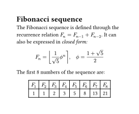
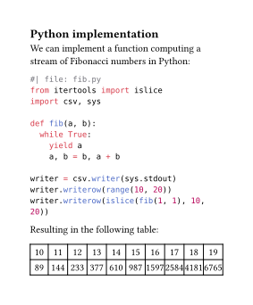
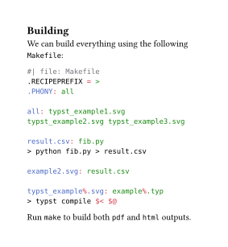

[Typst](https://typst.app/) is a type setting engine that is designed to replace LaTeX. Its notation is in some ways more similar to Markdown, and it comes with a custom extension language. The demo we are given in their README is as follows:

<div class="grid" markdown>

```typst title="Typst source"
= Fibonacci sequence
The Fibonacci sequence is defined through the recurrence
relation $F_n = F_(n - 1) + F_(n - 2)$. It can also be
expressed in _closed form:_

$ F_n = round(1 / sqrt(5) phi.alt^n), quad
    phi.alt = (1 + sqrt(5)) / 2 $

#let count = 8
#let nums = range(1, count + 1)
#let fib(n) = (
  if n <= 2 { 1 }
  else { fib(n - 1) + fib(n - 2) }
)

The first #count numbers of the sequence are:

#align(center, table(
  columns: count,
  ..nums.map(n => $F_#n$),
  ..nums.map(n => str(fib(n))),
))
```


</div>

Using Entangled we can expand this example with some Python code:

<div class="grid" markdown>

````typst
== Python implementation
We can implement a function computing a stream of Fibonacci 
numbers in Python:

```python
#| file: fib.py
from itertools import islice
import csv, sys

def fib(a, b):
  while True:
    yield a
    a, b = b, a + b

writer = csv.writer(sys.stdout)
writer.writerow(range(10, 20))
writer.writerow(islice(fib(1, 1), 10, 20))
```

Resulting in the following table:

#let result = csv("result.csv")
#align(center, table(
  columns: 10,
  ..result.flatten(),
))
````


</div>

And, to make it completely reproducible, provide a `Makefile` that builds these three images.

<div class="grid" markdown>

````typst
== Building
We can build everything using the following `Makefile`:

```makefile
#| file: Makefile
.RECIPEPREFIX = >
.PHONY: all

all: typst_example1.svg typst_example2.svg typst_example3.svg

result.csv: fib.py
> python fib.py > result.csv

example2.svg: result.csv

typst_example%.svg: example%.typ
> typst compile $< $@
```

Run `make` to build both `pdf` and `html` outputs.
````


</div>

## Remarks

The above examples used Entangled with the following config:

```toml title="entangled.toml"
version="2.4"
style="basic"
watch_list=["*.typ"]
```

- Typst is really fast if you're used to working with LaTeX.
- HTML export in Typst is not fully featured, but actually Pandoc does a much better job here.
